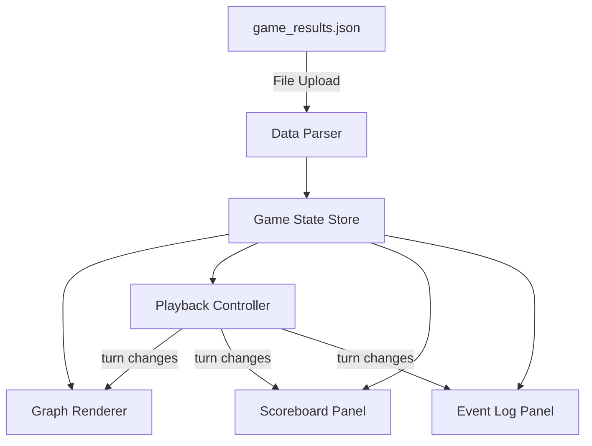

# Design Document: Frontend Visualization UI

## Overview

The frontend is a standalone React (JavaScript) single-page application that loads game result JSON files and renders an interactive visualization of Graph Model Arena games. It uses a force-directed graph layout library to render nodes/edges, provides turn-by-turn playback with variable speed, and displays live scoring and event information.

The architecture is intentionally simple: a static client-side app with no server dependency. Users upload their `game_results.json` file directly into the browser, and all processing happens client-side.

## Architecture



The app follows a unidirectional data flow pattern:
1. Raw JSON is parsed and validated
2. Parsed data is stored in a central state (React Context)
3. UI components read from state and react to turn changes
4. The Playback Controller drives turn progression, which triggers re-renders in dependent components

## Components and Interfaces

### Component Tree

```
App
├── FileUploader
├── GameSelector
└── GameVisualization
    ├── GraphCanvas
    │   └── NodeTooltip
    ├── PlaybackControls
    │   └── SpeedSelector
    ├── Scoreboard
    ├── EventLog
    └── PlayerLegend
```

### Component Responsibilities

| Component | Responsibility |
|-----------|---------------|
| `App` | Top-level routing between upload/selection and visualization |
| `FileUploader` | Handles file input, reads JSON, passes to parser |
| `GameSelector` | Shows list of games sorted by timestamp descending |
| `GameVisualization` | Container for all visualization panels |
| `GraphCanvas` | Renders the force-directed graph using react-force-graph-2d |
| `PlaybackControls` | Play/pause button, turn slider, speed selector |
| `SpeedSelector` | Dropdown/buttons for 1x, 1.5x, 2x, 3x, 4x speeds |
| `Scoreboard` | Shows player rankings at current turn |
| `EventLog` | Scrollable event list with click-to-jump |
| `PlayerLegend` | Color-to-strategy-name mapping |
| `NodeTooltip` | Hover popup with node ID and type |

### Key Interfaces

```javascript
// Parsed game data structure (from JSON)
GameData {
  gameId: string,
  timestamp: string,
  config: object,
  graph: { nodes: {}, edges: [] },
  models: { [modelId]: ModelState },
  eventLog: [ GameEvent ],
  rankings: [ RankedModel ],
  totalTurns: number
}

// State at a specific turn (computed)
TurnSnapshot {
  turn: number,
  playerPositions: { [modelId]: nodeId },
  playerScores: { [modelId]: number },
  playerStatuses: { [modelId]: 'active' | 'finished' },
  eventsThisTurn: [ GameEvent ]
}

// Graph node for rendering
GraphNode {
  id: string,
  type: 'START' | 'END' | 'NORMAL' | 'TRAP' | 'CLUE' | 'MAP' | 'CHECKPOINT' | 'POINTS',
  pointValue: number,
  x: number,  // computed by layout
  y: number   // computed by layout
}

// Graph link for rendering
GraphLink {
  source: string,
  target: string,
  cost: number,
  obstructed: boolean
}
```

### State Management

React Context with `useReducer` for game state:

```javascript
// GameContext actions
LOAD_GAMES     // parse and store all games from file
SELECT_GAME    // pick a specific game to visualize
SET_TURN       // update current turn (from slider or auto-play)
SET_SPEED      // change playback speed
TOGGLE_PLAY    // play/pause toggle
```

## Data Models

### JSON Input Format (from backend)

The frontend consumes the existing `game_results.json` format without modification. Each entry contains:

```javascript
{
  game_id: string,
  timestamp: string (ISO 8601),
  config: { graph_config: {...}, num_models, max_turns, ... },
  rankings: [{ rank, model_id, strategy_name, final_score, turns_taken, nodes_visited, cause_of_termination }],
  graph_stats: { num_nodes, num_edges, ... },
  total_turns: number,
  full_state: {
    graph: { nodes: {id, node_type, point_value}, edges: [{source, target, cost, obstructed}], start_node, end_node },
    models: { [model_id]: { current_node, score, visited_nodes, visible_nodes, visible_edges, ... } },
    event_log: [{ turn, model_id, event_type, details }],
    current_turn: number,
    max_turns: number
  }
}
```

### Derived Turn State Computation

To support turn-by-turn playback, we derive per-turn snapshots from the event log:

```javascript
function computeTurnSnapshots(fullState) {
  // Start: all players at start_node with score 0
  // For each turn, apply events to update positions and scores
  // Returns array of TurnSnapshot objects indexed by turn number
}
```

Key derivation rules:
- MOVE events update `playerPositions[modelId]` to `details.target_node`
- POINTS_COLLECTED events increment `playerScores[modelId]` by `details.points_awarded`
- TRAP_RESPAWN_START events move player to start node, decrement score by death_penalty
- TRAP_RESPAWN_CHECKPOINT events move player to checkpoint, decrement score by trap_respawn_penalty
- INVALID_MOVE events decrement score by invalid_move_penalty
- GAME_FINISHED events mark player status as 'finished'

### Node Color Mapping

```javascript
const NODE_COLORS = {
  START: '#4CAF50',       // green
  END: '#F44336',         // red
  NORMAL: '#9E9E9E',     // gray
  TRAP: '#FF9800',       // orange
  CLUE: '#2196F3',       // blue
  MAP: '#9C27B0',        // purple
  CHECKPOINT: '#FFEB3B', // yellow
  POINTS: '#FFD700'      // gold
};
```

### Player Color Assignment

Players get assigned distinct colors from a fixed palette on game load:

```javascript
const PLAYER_COLORS = [
  '#E91E63', '#00BCD4', '#8BC34A', '#FF5722',
  '#673AB7', '#009688', '#CDDC39', '#795548'
];
```

## Error Handling

| Scenario | Behavior |
|----------|----------|
| Invalid JSON uploaded | Display error toast: "Invalid JSON file. Please upload a valid game_results.json" |
| Missing `full_state` field | Display error: "Game data incomplete — full_state is required for visualization" |
| Empty game list | Display message: "No games found in this file" |
| Event references unknown model | Skip event silently, log warning to console |
| File too large (>50MB) | Display error: "File exceeds 50MB limit" |
| Browser doesn't support FileReader | Display error: "Your browser does not support file uploads" |

## Correctness Properties

*A property is a characteristic or behavior that should hold true across all valid executions of a system — essentially, a formal statement about what the system should do. Properties serve as the bridge between human-readable specifications and machine-verifiable correctness guarantees.*

### Property 1: Game list ordering

*For any* array of game results with distinct timestamps, the displayed game list shall always be sorted by timestamp in strictly descending order (most recent first).

**Validates: Requirements 1.2**

### Property 2: Invalid input error signaling

*For any* input string that is not valid JSON or any JSON object missing required fields (full_state, graph, models, event_log), the parser shall return an error result rather than a successful parse.

**Validates: Requirements 1.4**

### Property 3: Node visual attribute mapping

*For any* node in the game graph, the rendered color shall match the defined color for its node_type, and if its point_value is greater than zero, the point value label shall be present in the rendered output.

**Validates: Requirements 2.2, 2.3**

### Property 4: Edge rendering completeness and style

*For any* edge in the game graph, it shall appear in the rendered output with its cost label displayed, and if the edge is obstructed, it shall be rendered with a dashed line style.

**Validates: Requirements 2.4, 2.5, 2.6**

### Property 5: Turn snapshot computation correctness

*For any* valid game state and any turn T (0 ≤ T ≤ totalTurns), the computed turn snapshot shall have player positions and scores that reflect the cumulative application of all events from turn 0 through turn T.

**Validates: Requirements 4.2, 5.2**

### Property 6: Scoreboard completeness and ordering

*For any* turn snapshot, the scoreboard shall display all players sorted by score descending, and each entry shall contain strategy name, current score, current node, and correct termination status (checkmark if finished).

**Validates: Requirements 5.1, 5.3, 5.4**

### Property 7: Event log completeness and formatting

*For any* game event, the event log shall include an entry containing the turn number, model name, event type, and relevant details from the event.

**Validates: Requirements 6.1, 6.4**

### Property 8: Event log turn filtering

*For any* turn T, the set of highlighted events in the event log shall be exactly those events with turn number ≤ T.

**Validates: Requirements 6.2**

### Property 9: Playback speed interval correctness

*For any* selected playback speed S from {1, 1.5, 2, 3, 4}, the auto-advance interval shall equal 1000/S milliseconds (e.g., 1x = 1000ms, 2x = 500ms, 4x = 250ms).

**Validates: Requirements 4.3, 4.4**

### Property 10: Player marker presence and distinctness

*For any* game with N players (2 ≤ N ≤ 8), all N players shall be rendered with distinct colors, and a legend entry shall exist mapping each color to its strategy name.

**Validates: Requirements 3.1, 3.3**

## Error Handling

| Scenario | Behavior |
|----------|----------|
| Invalid JSON uploaded | Display error toast: "Invalid JSON file. Please upload a valid game_results.json" |
| Missing `full_state` field | Display error: "Game data incomplete — full_state is required for visualization" |
| Empty game list | Display message: "No games found in this file" |
| Event references unknown model | Skip event silently, log warning to console |
| File too large (>50MB) | Display error: "File exceeds 50MB limit" |
| Browser doesn't support FileReader | Display error: "Your browser does not support file uploads" |

## Testing Strategy

### Unit Tests

Use Vitest as the test runner with React Testing Library for component tests.

Key unit test areas:
- `computeTurnSnapshots`: verify correct state derivation from specific event sequences
- JSON parser/validator: verify acceptance of valid files and rejection of specific invalid inputs
- Scoreboard rendering: verify correct fields displayed for specific game states
- Playback controls: verify play/pause toggling, slider bounds
- Responsive layout: verify panel arrangement at specific viewport widths

### Property-Based Tests

Use fast-check with Vitest for property-based testing.

Each property test must:
- Run a minimum of 100 iterations
- Reference the design property it validates via a tag comment
- Tag format: **Feature: frontend-visualization, Property {N}: {title}**

Property tests target the pure logic layers:
- Turn snapshot computation (Property 5)
- Game list sorting (Property 1)
- Input validation (Property 2)
- Scoreboard ordering (Property 6)
- Event log filtering (Property 8)
- Playback interval calculation (Property 9)
- Color/style mapping functions (Properties 3, 4, 10)

