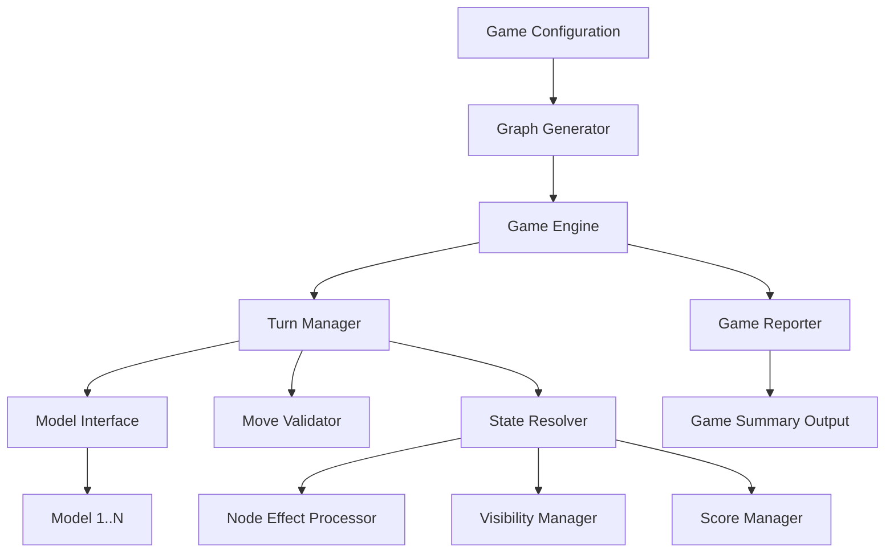
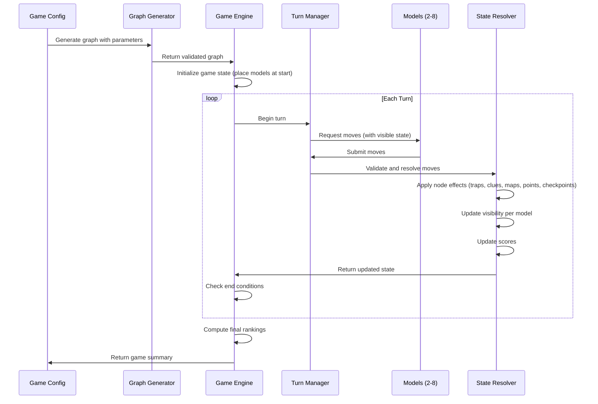

# Design Document: Graph Model Arena

## Overview

Graph Model Arena is a turn-based competitive simulation where 2-8 AI models navigate a dynamically generated graph from a starting node to an ending node. The system consists of a graph generator, a game engine that manages turns and state, a model interface for pluggable AI strategies, and a scoring/ranking system. The graph features fog-of-war visibility, special node types (traps, checkpoints, clues, maps, points), and obstacles — creating a rich strategic environment.

The system is designed as a standalone application with a clear separation between graph generation, game logic, model interface, and output/reporting.

## Architecture



### Component Interaction Flow



## Components and Interfaces

### 1. Graph Generator

Responsible for creating a randomized, valid graph for each game.

**Interface:**
```
generate_graph(config: GraphConfig) -> Graph
```

**Responsibilities:**
- Create a connected graph with the configured number of nodes and edge density
- Assign one Starting_Node and one Ending_Node
- Validate that at least one path exists from start to end
- Validate that at least one trap-free path exists from start to end
- Assign node properties based on configured probability distributions
- Assign edge traversal costs (1-10)
- Place obstacles on edges without breaking reachability

**Algorithm outline:**
1. Generate nodes and connect them using a random spanning tree to guarantee connectivity
2. Add additional random edges based on edge density parameter
3. Designate start and end nodes (maximizing distance for interesting gameplay)
4. Assign node types using weighted random selection from configured probabilities
5. Place obstacles on non-bridge edges (edges whose removal would disconnect the graph) to preserve reachability
6. Verify a trap-free path exists from start to end; if not, convert trap nodes along one safe path to normal nodes
7. Assign edge costs randomly in range [1, 10]

### 2. Game Engine

The central orchestrator managing the full game lifecycle.

**Interface:**
```
create_game(config: GameConfig) -> Game
start_game(game: Game) -> GameResult
```

**Responsibilities:**
- Accept game configuration and initialize all subsystems
- Coordinate turn execution
- Track game state across turns
- Detect end conditions (all models finished, max turns reached)
- Produce final rankings and game summary

### 3. Turn Manager

Handles the execution of a single turn.

**Interface:**
```
execute_turn(game_state: GameState) -> GameState
```

**Responsibilities:**
- Collect move decisions from all active models (with timeout)
- Pass moves to the Move Validator
- Pass validated moves to the State Resolver
- Return updated game state

### 4. Move Validator

Validates model move submissions.

**Interface:**
```
validate_move(model_id: str, target_node: str, game_state: GameState) -> MoveResult
```

**Responsibilities:**
- Check that target node is adjacent to model's current position
- Check that the connecting edge is not obstructed
- Return valid/invalid status with reason

### 5. State Resolver

Applies all validated moves and resolves their effects.

**Interface:**
```
resolve_moves(moves: list[ValidatedMove], game_state: GameState) -> GameState
```

**Responsibilities:**
- Move models to their target nodes simultaneously
- Trigger node effects in order: checkpoint activation, trap check, clue reveal, map reveal, points collection
- Update model states (position, score, visibility, checkpoint)
- Handle trap respawn: reposition model to checkpoint or Starting_Node as appropriate

### 6. Node Effect Processor

Processes the effect of a node on a model that enters it.

**Interface:**
```
process_node_effect(model_state: ModelState, node: Node, game_state: GameState) -> ModelState
```

**Responsibilities:**
- Apply checkpoint: record as active respawn point
- Apply trap: respawn at checkpoint with penalty (if checkpoint active), or respawn at Starting_Node with death penalty (if no checkpoint)
- Apply clue: reveal one random neighbor's type
- Apply map: expand visibility by configured depth
- Apply points: add points if first visit, zero if revisit

### 7. Visibility Manager

Manages per-model fog-of-war state.

**Interface:**
```
get_visible_graph(model_id: str, game_state: GameState) -> VisibleGraph
expand_visibility(model_id: str, center_node: str, depth: int, game_state: GameState) -> GameState
```

**Responsibilities:**
- Track which nodes and edges each model has discovered
- Provide filtered graph views per model
- Expand visibility on movement (depth 1) and map node visits (configurable depth)

### 8. Score Manager

Manages scoring logic.

**Interface:**
```
apply_points(model_state: ModelState, node: Node) -> ModelState
apply_completion_bonus(model_state: ModelState, turns_taken: int, max_turns: int, bonus_multiplier: float) -> ModelState
apply_death_penalty(model_state: ModelState, penalty: int) -> ModelState
apply_invalid_move_penalty(model_state: ModelState) -> ModelState
compute_final_rankings(model_states: list[ModelState]) -> list[RankedModel]
```

### 9. Model Interface

The contract that all AI model strategies must implement.

**Interface:**
```
class ModelStrategy:
    def decide_move(self, state: ModelView) -> str:
        """Given the model's visible state, return the target node ID."""
        ...
```

**ModelView contains:**
- current_node: str
- visible_nodes: dict of node_id to NodeInfo (type, point_value if known)
- visible_edges: list of (node_a, node_b, cost, obstructed)
- current_score: int
- turn_number: int
- has_checkpoint: bool
- checkpoint_node: str or None

### 10. Game Reporter

Produces structured output after game completion.

**Interface:**
```
generate_summary(game: Game) -> GameSummary
serialize_game(game: Game) -> dict  # includes full graph, all moves, scores, events
```

## Data Models

### GraphConfig
```
GraphConfig:
    num_nodes: int (20-200)
    edge_density: float (0.0-1.0, proportion of possible edges beyond spanning tree)
    trap_probability: float (0.0-1.0)
    clue_probability: float (0.0-1.0)
    map_probability: float (0.0-1.0)
    checkpoint_probability: float (0.0-1.0)
    points_probability: float (0.0-1.0)
    obstacle_density: float (0.0-1.0)
    map_reveal_depth: int (1-3)
    min_point_value: int (1)
    max_point_value: int (10)
```

### GameConfig
```
GameConfig:
    graph_config: GraphConfig
    num_models: int (2-8)
    max_turns: int
    move_timeout_seconds: float
    completion_bonus_multiplier: float
    death_penalty: int
    invalid_move_penalty: int (default 1)
    trap_respawn_penalty: int
```

### Node
```
Node:
    id: str
    node_type: enum (NORMAL, START, END, TRAP, CLUE, MAP, CHECKPOINT, POINTS)
    point_value: int (only for POINTS nodes, 1-10)
```

### Edge
```
Edge:
    source: str (node id)
    target: str (node id)
    cost: int (1-10)
    obstructed: bool
```

### Graph
```
Graph:
    nodes: dict of node_id to Node
    edges: list of Edge
    adjacency: dict of node_id to list of (neighbor_id, edge)
    start_node: str
    end_node: str
```

### ModelState
```
ModelState:
    model_id: str
    strategy_name: str
    current_node: str
    score: int
    has_finished: bool
    active_checkpoint: str or None
    visited_nodes: set of str
    visible_nodes: set of str
    visible_edges: set of (str, str)
    turns_taken: int
    trap_deaths: int (number of times respawned from traps)
```

### GameState
```
GameState:
    graph: Graph
    models: dict of model_id to ModelState
    current_turn: int
    max_turns: int
    config: GameConfig
    event_log: list of GameEvent
```

### GameEvent
```
GameEvent:
    turn: int
    model_id: str
    event_type: enum (MOVE, TRAP_RESPAWN_START, TRAP_RESPAWN_CHECKPOINT, CLUE_RECEIVED, MAP_REVEALED, POINTS_COLLECTED, CHECKPOINT_ACTIVATED, INVALID_MOVE, TIMEOUT, GAME_FINISHED, GAME_ENDED_BY_TURN_LIMIT)
    details: dict
```

### GameSummary
```
GameSummary:
    graph: Graph (full graph including all nodes, edges, and properties)
    rankings: list of RankedModel
    total_turns: int
    graph_stats: dict (num_nodes, num_edges, num_traps, etc.)
    event_log: list of GameEvent

RankedModel:
    rank: int
    model_id: str
    strategy_name: str
    final_score: int
    turns_taken: int
    nodes_visited: int
    cause_of_termination: enum (FINISHED, TURN_LIMIT)
    path: list of str
```


## Correctness Properties

*A property is a characteristic or behavior that should hold true across all valid executions of a system — essentially, a formal statement about what the system should do. Properties serve as the bridge between human-readable specifications and machine-verifiable correctness guarantees.*

### Property 1: Generated graphs are connected with correct node count

*For any* valid GraphConfig with num_nodes in [20, 200], the generated graph SHALL be connected (every node reachable from every other node) and contain exactly num_nodes nodes.

**Validates: Requirements 1.1**

### Property 2: Start and end nodes exist with a valid path

*For any* generated graph, there SHALL be exactly one Starting_Node and exactly one Ending_Node, and at least one path SHALL exist between them using non-obstructed edges.

**Validates: Requirements 1.2, 1.5**

### Property 3: A trap-free path exists from start to end

*For any* generated graph, there SHALL exist at least one path from Starting_Node to Ending_Node that does not pass through any Trap_Node, using only non-obstructed edges.

**Validates: Requirements 1.3**

### Property 4: All edge costs are in valid range

*For any* generated graph, every edge SHALL have a positive integer traversal cost in the range [1, 10].

**Validates: Requirements 1.6**

### Property 5: Node types are validly assigned

*For any* generated graph, every node SHALL have exactly one valid node_type, the Starting_Node and Ending_Node SHALL not be assigned Trap, Clue, Map, Checkpoint, or Points types, and all assigned types SHALL be from the defined enum.

**Validates: Requirements 1.4**

### Property 6: Trap respawn at start without checkpoint

*For any* model without an active checkpoint that enters a Trap_Node, the model SHALL remain alive, be repositioned at the Starting_Node, and the model's score SHALL be reduced by the configured death_penalty.

**Validates: Requirements 2.1, 5.4**

### Property 7: Trap respawn with checkpoint

*For any* model with an active checkpoint that enters a Trap_Node, the model SHALL be alive, positioned at the checkpoint node, and the model's score SHALL be reduced by the configured trap_respawn_penalty.

**Validates: Requirements 2.2**

### Property 8: Clue node reveals exactly one neighbor's type

*For any* model entering a Clue_Node, exactly one neighboring node's type SHALL be added to that model's known information, and no other model's visibility SHALL change.

**Validates: Requirements 2.3, 3.4**

### Property 9: Map node expands visibility by configured depth

*For any* model entering a Map_Node, all nodes and edges within the configured map_reveal_depth from that Map_Node SHALL be added to that model's visibility, and no other model's visibility SHALL change.

**Validates: Requirements 2.4, 3.3, 3.4**

### Property 10: Checkpoint activation

*For any* model entering a Checkpoint_Node, the model's active_checkpoint SHALL be set to that Checkpoint_Node's ID.

**Validates: Requirements 2.5**

### Property 11: Points collection — first visit vs. revisit

*For any* model entering a Points_Node, if the node is not in the model's visited set, the model's score SHALL increase by the node's point_value; if the node is already in the model's visited set, the model's score SHALL remain unchanged.

**Validates: Requirements 2.6, 2.7, 5.2**

### Property 12: Initialization invariant

*For any* newly started game with N models, all models SHALL be positioned at the Starting_Node, all models SHALL have a score of zero, all models SHALL be alive and not finished, and each model's visibility SHALL contain exactly the Starting_Node and its immediate neighbors.

**Validates: Requirements 3.1, 5.1, 7.2**

### Property 13: Movement expands visibility

*For any* model that moves to a new node, the model's visible_nodes SHALL be a superset of its previous visible_nodes plus the new node and all of the new node's neighbors.

**Validates: Requirements 3.2**

### Property 14: ModelView accuracy

*For any* model at any point in the game, the ModelView provided to that model SHALL contain only nodes within the model's visibility set, and node type information SHALL only be included for visible nodes. The current_node, current_score, turn_number, and checkpoint status SHALL match the underlying game state.

**Validates: Requirements 3.5, 6.1**

### Property 15: Move validation correctness

*For any* move submission, the move SHALL be accepted if and only if the target node is adjacent to the model's current position AND the connecting edge is not obstructed.

**Validates: Requirements 4.2**

### Property 16: Invalid move penalty

*For any* model that submits an invalid move, the model's position SHALL remain unchanged and the model's score SHALL decrease by the configured invalid_move_penalty.

**Validates: Requirements 4.3**

### Property 17: Simultaneous move resolution is order-independent

*For any* set of valid moves in a turn, the resulting game state SHALL be the same regardless of the order in which moves are processed.

**Validates: Requirements 4.4**

### Property 18: Completion bonus calculation

*For any* model that reaches the Ending_Node, the model's score SHALL include a completion bonus equal to (max_turns - turns_taken) * completion_bonus_multiplier.

**Validates: Requirements 4.5, 5.3**

### Property 19: Timeout results in no-op without penalty

*For any* model that times out during move computation, the model's position and score SHALL remain unchanged.

**Validates: Requirements 4.6**

### Property 20: Final ranking correctness

*For any* completed game, models SHALL be ranked by final score in descending order, with ties broken by fewer turns taken (ascending).

**Validates: Requirements 5.5**

### Property 21: Game summary completeness

*For any* completed game, the game summary SHALL contain the full graph, each model's final score, rank, path taken, nodes visited, and cause of termination.

**Validates: Requirements 5.6**

### Property 22: Unique model identifiers

*For any* game with N models, all model IDs SHALL be unique.

**Validates: Requirements 6.3**

### Property 23: Model count bounds

*For any* GameConfig, the game SHALL accept configurations with 2-8 models and reject configurations outside this range.

**Validates: Requirements 6.4**

### Property 24: Game ends when all models have finished

*For any* game state where all models have reached the Ending_Node, the game SHALL end.

**Validates: Requirements 7.3**

### Property 25: Turn limit ends game with proximity scoring

*For any* game that reaches the maximum turn limit, the game SHALL end and remaining active models SHALL receive a score based on their proximity (shortest path distance) to the Ending_Node.

**Validates: Requirements 7.4**

### Property 26: Game state serialization round trip

*For any* completed game state, serializing and then deserializing SHALL produce an equivalent game state.

**Validates: Requirements 7.5**

### Property 27: All model strategies produce valid moves

*For any* of the 8 built-in model strategies and any valid ModelView, the strategy SHALL return a node ID that is adjacent to the current node in the visible graph.

**Validates: Requirements 8.1, 8.2, 8.3, 8.4, 8.5, 8.6, 8.7, 8.8**

## Error Handling

### Model Errors
- If a model's `decide_move` raises an unhandled exception, the Game_Engine catches it, logs the error with model ID and turn number, and treats the move as a no-op with no penalty (Requirement 6.5)
- If a model returns a non-string or empty value, it is treated as an invalid move with the standard penalty

### Configuration Errors
- Invalid GraphConfig values (e.g., num_nodes < 20 or > 200, probabilities outside [0, 1]) raise a validation error before game creation
- Invalid GameConfig values (e.g., num_models < 2 or > 8) raise a validation error before game creation

### Graph Generation Errors
- If the generator cannot produce a valid graph after a configurable number of retries (e.g., due to extreme obstacle density making trap-free paths impossible), it raises a generation error with diagnostic information
- The generator validates all invariants (connectivity, reachability, trap-free path) before returning

### Runtime Errors
- Move timeout: handled as no-op per Requirement 4.6
- Serialization errors: logged and the game continues; summary generation is best-effort

## Testing Strategy

### Unit Tests
Unit tests cover specific examples, edge cases, and error conditions:

- Graph generation with minimum (20) and maximum (200) node counts
- Graph generation with zero obstacle density and maximum obstacle density
- Trap node respawn at Starting_Node without checkpoint and at checkpoint with checkpoint
- Points collection on first visit vs. revisit
- Move validation with adjacent, non-adjacent, and obstructed edges
- Completion bonus calculation with specific turn counts
- Ranking with tied scores
- Model exception handling
- Configuration validation boundary cases
- Each of the 8 model strategies with specific graph configurations

### Property-Based Tests
Property-based tests validate universal correctness properties using a property-based testing library (e.g., Hypothesis for Python, fast-check for TypeScript).

Each property test:
- Runs a minimum of 100 iterations with randomly generated inputs
- References its design document property number
- Is tagged with: **Feature: graph-model-arena, Property {N}: {title}**

Property tests are organized by component:
1. **Graph Generator properties** (Properties 1-5): Generate random GraphConfigs, produce graphs, verify invariants
2. **Node effect properties** (Properties 6-11): Generate random game states with models at various node types, verify respawn and state transitions
3. **Visibility properties** (Properties 12-14): Generate random game states, perform moves, verify visibility expansion
4. **Turn mechanics properties** (Properties 15-19): Generate random moves (valid/invalid), verify validation and resolution
5. **Scoring and ranking properties** (Properties 20-21): Generate random game results, verify ranking and summary
6. **Game lifecycle properties** (Properties 22-26): Generate random configs and game states, verify lifecycle invariants
7. **Model strategy properties** (Property 27): Generate random ModelViews, verify all strategies produce valid moves

### Test Data Generation
Custom generators needed:
- `arbitrary_graph_config()`: Generates valid GraphConfig within bounds
- `arbitrary_graph()`: Generates valid Graph instances
- `arbitrary_game_state()`: Generates valid GameState with models at various positions
- `arbitrary_model_view()`: Generates valid ModelView from a game state
- `arbitrary_move_set()`: Generates sets of valid and invalid moves
